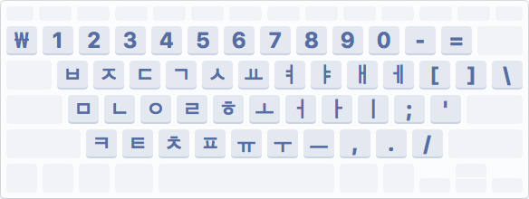

MarkDown 문서를 작성하는 경우 Back quote(<code class="highlighter-rouge">`</code>)를 사용할 일이 아주 많다.

그런데 종종 Back quote를 누르면 원화기호가 나온다. 왜 그런걸까?

<br>

{: .center-img width="300px"}

위는 macOS의 두벌식 입력 소스 키 레이아웃이다.  
<code class="highlighter-rouge">`</code>가 `₩`로 변경된다. `option` 키를 함께 누르면 <code class="highlighter-rouge">`</code>를 입력할 수 있지만 굉장히 불편하다.

<br>
아래의 코드를 넣고 `~/Library/Keybindings/DefaultKeybinding.dict`로 파일을 생성하면 해결된다.

```python
{
  "₩" = ("insertText:", "`");
}
```


<br>

혹은 터미널에서 아래의 명령어를 입력하면 알아서 `DefaultKeybinding.dict`를 생성해준다.

```
curl -sSL https://gist.githubusercontent.com/redism/43bc51cab62269fa97a220a7bb5e1103/raw/0d55b37b60e0e0bd3d0d7f53995de0a722f9820c/kr_won_to_backquote.sh | sh
```


출처:  
[A2 Blog](https://ani2life.com/wp/?p=1753)  
[Gist](https://gist.github.com/redism/43bc51cab62269fa97a220a7bb5e1103)
