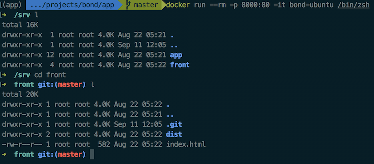
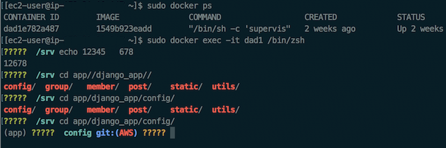

나는 `zsh`이 macOS나 Linux의 기본 셸보다 사용하기 편해서 가상환경에도 설치해 사용한다.

`ElasticBeanstalk`를 이용해 서버를 배포할 때, `Docker image`에 `zsh`을 설치하였었다.  
그런데 `zsh`을 이용하여 `Docker container`에 들어간 경우 아래와 같이 글씨가 제대로 출력되지 않고,
백스페이스를 눌러도 글자가 지워지지 않고 뒤에 빈 공백이 생기는 이상한 현상이 생겼다.

나와 같은 상황을 겪는데 귀찮아서 고치지않고 대충 저 상태로 사용하는 분들을 위해 글을 적는다.


{:width="100%"}
로컬 환경에서 동작하는 `Docker container`의 `zsh`은 문제없이 동작한다.  
<br>

{:width="100%"}
배포 환경에서 `Docker container`의 `zsh`은 기호가 `????`로 표시되고 및 백스페이스는 제대로 표시되지 않는다.  
<br>

해결하는 방법은 간단하다.
`Docker container`의 `.zshrc`에

```
export TERM=xterm-256color
```

1줄만 추가해주면 끝이다.
다만 이렇게 `container`에 직접 들어가서 `.zshrc`를 수정하게 되면,
매번 `container`가 재시작될때마다 입력해줘야한다.

그러므로 `Dockerfile`에, `zsh`을 설치하고 난 다음 저 부분을 자동으로 추가하도록 해주자.

```
RUN         echo 'export TERM=xterm-256color' >> ~/.zshrc
```

`Dockerfile`을 다시 `build`하고 마무리


출처 : [StackOverflow](https://askubuntu.com/questions/54145/how-to-fix-strange-backspace-behaviour-with-urxvt-zsh)