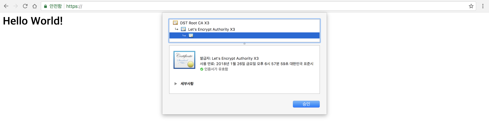

> 이 글은 AWS EC2(Ubuntu 16.04), Nginx를 이용하는 환경을 기준으로 제가 직접 Let's encrypt를 이용해 SSL 인증서를 발급받고, 적용시킨 방법에 대해 적어둔 글입니다.
> 더 좋은 방법이나, 제가 작성하면서 잘못된 부분이 있다면 댓글 달아주시면 감사하겠습니다.

SSL 인증서는, 웹서버와 웹사이트에서 이루어지는 모든 정보전송이 https로 암호화프로토콜을 통해 안전하게 전송되게 하는 인증서다.  
인증서 사용 목적으로는 스니핑 방지, 피싱 방지, 데이터 변조 방지, 웹 애플리케이션을 운영하는 기업에 대한 신뢰도 향상 등이 있겠다.  
오늘은 이 SSL 인증서를 무료로 발급해주는 Let's encrypt를 직접 적용해보도록 하자.  

<br>

먼저 Let's encrypt를 적용시킬 웹 애플리케이션이 실행되는 서버에 ssh로 접속을 하자.  
그리고 Let's encrypt의 Github repository를 clone해준다

```
sudo git clone https://github.com/letsencrypt/letsencrypt /opt/letsencrypt
```

clone이 완료가 됐다면, 인증서를 발행받기 위해 사용할 plugin을 고르도록하자.  
Let's encrypt의 [User Guide](http://letsencrypt.readthedocs.io/en/latest/using.html)를 보면 인증서를 발급받기 위해 이용하는 plugin의 종류가 많이 보인다.  
그 중에서 webroot를 사용하도록 하자.
> Nginx plugin도 있지만 잘못되는 경우 rollback을 할 필요가 있다고 적혀있기 때문에 사용하지 않기로 했다.

그렇다면 webroot를 사용하기 위해, Nginx config file에 몇가지를 추가해줘야한다.

<br>

기존에 Nginx를 이용하고 있다면, `/etc/nginx/sites-available/` 디렉터리에 아래와 비슷한 config file이 있을 것이다.

```
# /etc/nginx/sites-available/mysite.conf

server {
    listen 80;
    server_name www.mysite.com;
    charset utf-8;
    client_max_body_size 128M;

    location / {
        uwsgi_pass    unix:///tmp/mysite.sock;
        include       uwsgi_params;
    }
}
```
> server_name이나 location에 적혀있는 내용은 다를 수 있다. 작성자는 uWSGI를 이용해 Nginx와 통신하고 있음.

위 파일에 내용을 추가해서 아래처럼 만든다.

```
# /etc/nginx/sites-available/mysite.conf

server {
    listen 80;
    server_name www.mysite.com;
    charset utf-8;
    client_max_body_size 128M;

    location / {
        uwsgi_pass    unix:///tmp/mysite.sock;
        include       uwsgi_params;
    }

    location ^~ /.well-known/acme-challenge/ {
        default_type "text/plain";
        root         /var/www/letsencrypt;
    }

    location = /.well-known/acme-challenge/ {
        return 404;
    }
}
```

> Webroot 방식은 `/.well-known/acme-challenge/`에 임시 파일을 생성하고, 유효성을 검사하는 서버에서 해당 DNS가 Let's encrypt를 이용하고 있는지에 대해 검사를 HTTP 요청으로 확인한다. 해당 내용은 [User Guide](http://letsencrypt.readthedocs.io/en/latest/using.html#webroot)에 상세하게 설명되어있다.

<br>

위의 내용을 추가해줬다면, 변동사항을 적용하기 위해 Nginx를 한번 reload해줘야 한다.
```
sudo service nginx reload
```

그리고, 임시 파일을 생성할 디렉터리를 생성해준다.
```
sudo mkdir -p /var/www/letsencrypt
```

<br>

모든 준비가 끝났다면, 인증서를 발급받자!

```
/opt/letsencrypt/letsencrypt-auto certonly --webroot -w /var/www/letsencrypt -m my@email.com -d www.mysite.com
```

실행을 하면 몇가지 사항을 물어보는데 확인 및 동의를 마치면

```
Performing the following challenges:
http-01 challenge for www.mysite.com
Using the webroot path /var/www/letsencrypt for all unmatched domains.
Waiting for verification...
Cleaning up challenges

IMPORTANT NOTES:
 - Congratulations! Your certificate and chain have been saved at:
   /etc/letsencrypt/live/www.mysite.com/fullchain.pem
   Your key file has been saved at:
   /etc/letsencrypt/live/www.mysite.com/privkey.pem
   Your cert will expire on 2018-01-26. To obtain a new or tweaked
   version of this certificate in the future, simply run
   letsencrypt-auto again. To non-interactively renew *all* of your
   certificates, run "letsencrypt-auto renew"
 - If you like Certbot, please consider supporting our work by:

   Donating to ISRG / Let's Encrypt:   https://letsencrypt.org/donate
   Donating to EFF:                    https://eff.org/donate-le
```


이렇게 `/etc/letsencrypt/live/www.mysite.com/` 위치에 키를 생성하는데 성공했다는 메시지가 뜬다. 또한 만료 기한을 알려준다.(Let's encrypt가 발행한 SSL 인증서의 유효 기간은 3개월이다)

<br>

인증서 발급에 성공했으니, 이제 발급한 인증서를 이용해 https(443 Port)를 이용해 접속할 수 있도록, 한번더 Nginx config file을 수정한다.

```
# /etc/nginx/sites-available/mysite.conf

server {
    listen 80;
    server_name www.mysite.com;
    charset utf-8;
    client_max_body_size 128M;

    location / {
        rewrite ^ https://$http_host$request_uri? permanent;
        return 301;
    }

    location ^~ /.well-known/acme-challenge/ {
        default_type "text/plain";
        root         /var/www/letsencrypt;
    }

    location = /.well-known/acme-challenge/ {
        return 404;
    }
}

server {
	server_name www.mysite.com;
	listen 443 ssl http2 default_server;
	listen [::]:443 ssl http2 default_server ipv6only=on;

	ssl_certificate /etc/letsencrypt/live/www.mysite.com/fullchain.pem;
	ssl_certificate_key /etc/letsencrypt/live/www.mysite.com/privkey.pem;
	ssl_trusted_certificate /etc/letsencrypt/live/www.mysite.com/fullchain.pem;

    location / {
        uwsgi_pass    unix:///tmp/mysite.sock;
        include       uwsgi_params;
    }
}
```

http(80 port)를 이용해 접속하면, Nginx 단에서 https로 보내도록 설정을 추가해줬고, https(443 port)를 이용해 접속하면, 우리가 발급받은 SSL 인증서를 이용하도록 설정을 추가했다.

AWS console에서 우리가 인증서를 발급한 EC2 Instance의 Security Group Inbound에 HTTPS(443 port)를 추가해주고, 접속이 잘 되는지 한번 사이트에 접속을 해보도록 하자!

{:width="100%"}

Chrome의 주소창에 녹색 자물쇠 아이콘과 안전함이라는 문구가 보이고, 인증서를 확인 할 수 있다.

<br>

이제 남은건 인증서를 자동으로 갱신하고 갱신이 끝나면 nginx를 reload 하도록 만드는 것 뿐이다.

```
sudo crontab -e
```
위 명령어를 입력하여 crontab에 아래의 작업을 추가해주자

```
30 5 1 * * /bin/bash -l -c '/opt/letsencrypt/letsencrypt-auto renew --quiet --no-self-upgrade && service nginx reload'
```

매달 1일 5시 30분에 SSL 인증서 갱신 시도를 하고, nginx를 reload 하도록 추가하였다.  
renew를 하면 인증서 기간이 30일 이상이라면 인증서를 갱신하지 않고 30일 미만인 인증서만 갱신한다.  

renew를 하는 경우, `/etc/letsencrypt/renewal/www.mysite.com.conf` 파일을 참조해서 인증서를 갱신을 하며 파일의 내용은 아래와 같다.

```
# renew_before_expiry = 30 days
version = 0.19.0
archive_dir = /etc/letsencrypt/archive/www.mysite.com
cert = /etc/letsencrypt/live/www.mysite.com/cert.pem
privkey = /etc/letsencrypt/live/www.mysite.com/privkey.pem
chain = /etc/letsencrypt/live/www.mysite.com/chain.pem
fullchain = /etc/letsencrypt/live/www.mysite.com/fullchain.pem

# Options used in the renewal process
[renewalparams]
authenticator = webroot
installer = None
account = #################
webroot_path = /var/www/letsencrypt,
[[webroot_map]]
www.mysite.com = /var/www/letsencrypt
```

최초로 SSL 인증서를 발급받을때 사용한 정보가 기록되어있기 때문에 renew를 실행할 때, 별도의 option parameter를 입력해 줄 필요 없다.

자동으로 SSL 인증서를 갱신하는 것 까지 끝마쳤다.

이것으로 웹 애플리케이션에 Let's encrypt를 이용해 SSL 인증서 발급 및 적용시키기를 마치겠다.
